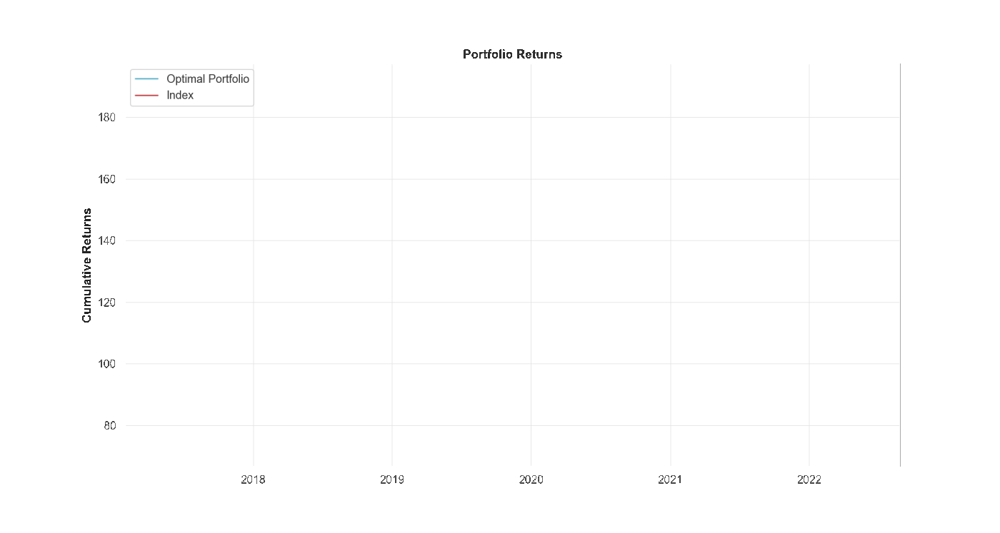

## JSE Top 40 Portfolio Optimisation using Monte Carlo Simulations

#### In this notebook, I try to construct an optiminal investment portfolio at random and compare it with the benchmark.

This is done with the use of Monte Carlo Simulations and Modern Portfolio Theory (MPT). The portfolio contains the same holdings as the benchmark but with different weights assigned to each company. In this case the benchmark is the FTSE/JSE Top 40 Index (index) which is constructed to represent the performance of the major capital and industry segments of the South African market [read more here.](http://www.ftserussell.com/products/indices/jse)

---
## About Me
http://www.linkedin.com/in/thabangndhlovu

## Disclaimer
This notebook is entirely for educational purposes. None of the information in this notebook constitutes a recommendation that any particular portfolio of securities is suitable for any particular person. All trading strategies are used at your own risk.
